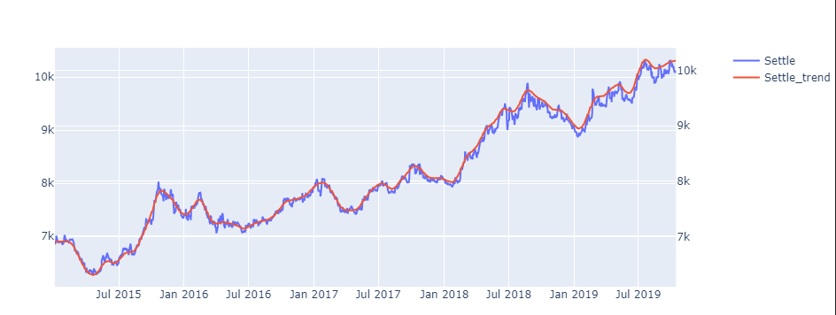
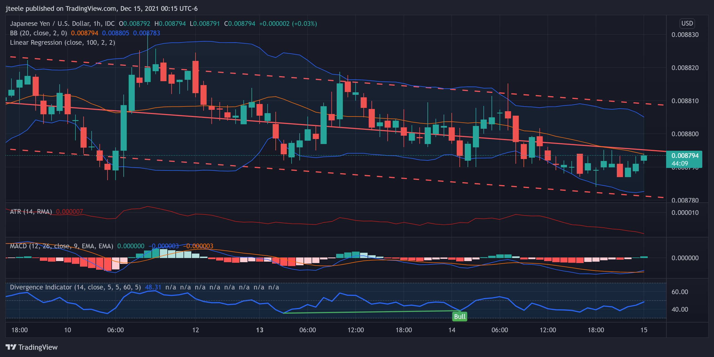

>## *Predict futures - JPY vs.  USD*  
#

 

#

>### Overview: 
>> This script will *leverage* Time Series Forecasting & Linear Regression Modeling to *predict* future price movements

>> No fancy imports for this time series analysis as this script utilizes basic core python libraries (e.g. numpy, pandas & plotly)

 

>## What is Time Series Analysis?
> [Data Science](https://medium.com/swlh/time-series-analysis-7006ea1c3326): Time series forecasting is a method of using a model to predict future values based on previously observed time series values.

>

 

#

#

## Resources:
1. Northwestern NPS:
https://sps.northwestern.edu/

2. Time Series (Medium):
https://medium.com/swlh/time-series-analysis-7006ea1c3326.

